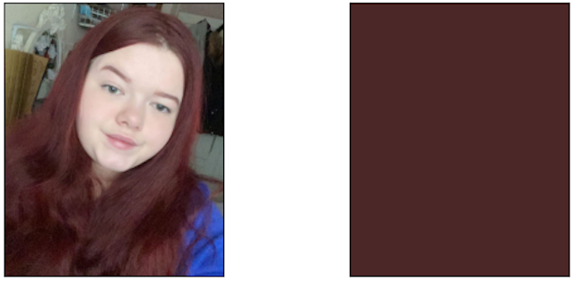
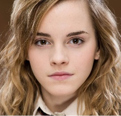
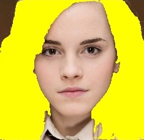
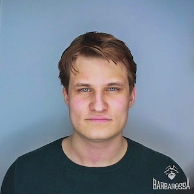
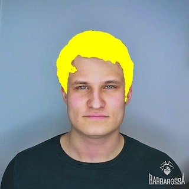

## Example of using mediapipe hair segmentation in python

Feel free to use this code in your purposes.

Note: build of hair segmentation model can be found here: https://hub.docker.com/u/eoastafurov1

----
##### Estimate hair color from mask:

##### Some examples of hair segmentation masks:

--

--

